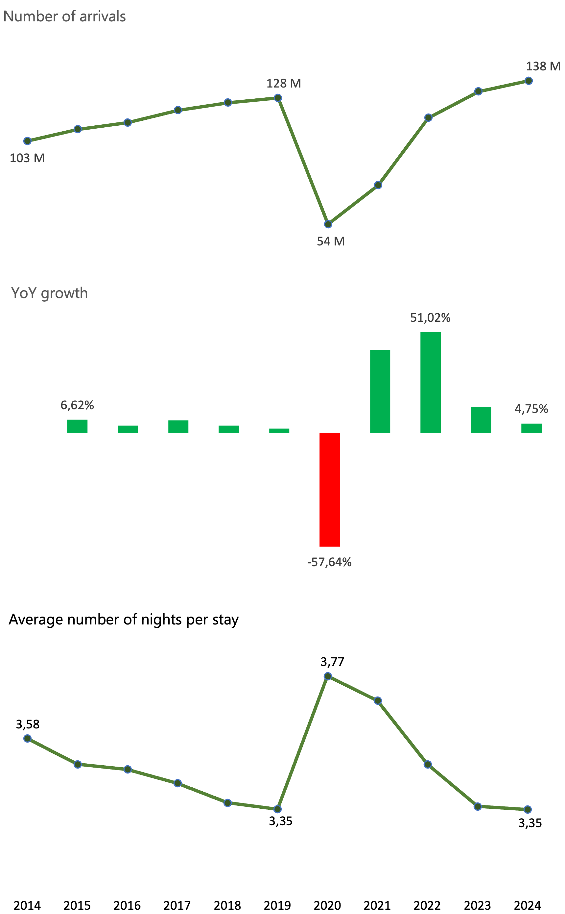
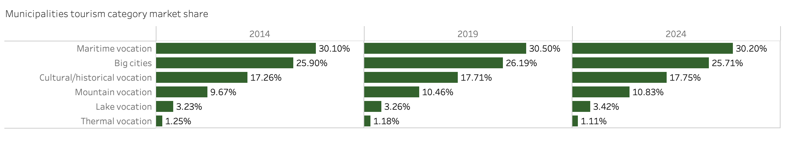
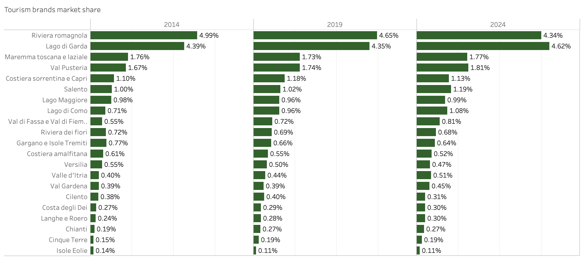
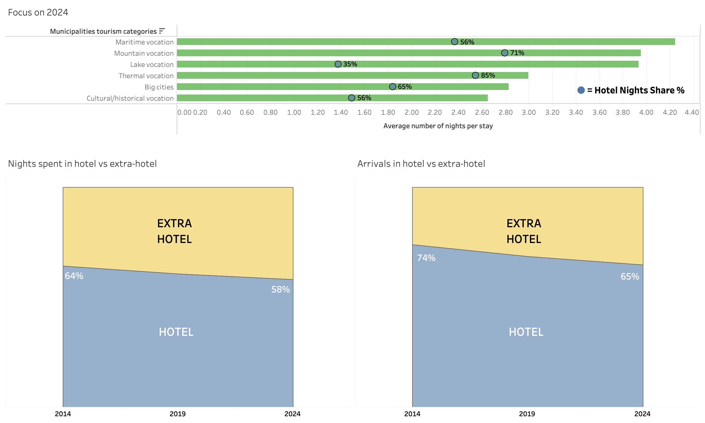
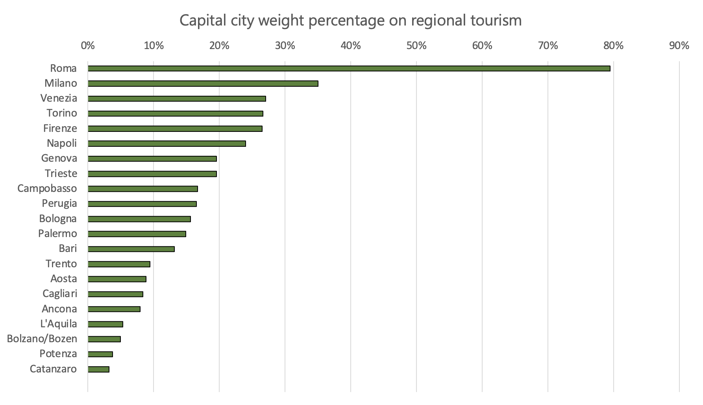

# Strategic Hotel Expansion in Italy: a Data-Driven Analysis of Tourism Trends (2014-2024)
## Executive Summary
Using Power Query, SQL and Tableau, I extracted Italian tourism data between 2014 and 2024 from the ISTAT database, creating charts and tables to track the evolution of visitors choices. After assigning a score to every municipality, based on the number of arrivals, its growth rate over the decade, and the average number of nights per stay, I recommend as best options where to extend a hotel chain:
- Trentino - Alto Adige region, including Lago di Garda and surroundings, as main hubs for mountain and lake holidays;
- southern regions like Calabria, Puglia, Sicilia and Sardegna as maritime destinations.

In general, more and more tourists are visiting Italy, but the average length of stay is unchanged between 2019 and 2024. It means that the overall market growth is driven by a higher volume of travelers rather than an increase in stay duration per visitor, highlighting a strategic opportunity to develop 'long-stay' incentives to maximize the economic impact per arrival.

Further steps would be the analysis of construction costs in each region and the evaluation of tourism seasonality in mountain and maritime destinations.

## Business Problem
A hotel chain is willing to expand its business along the Italian peninsula. As their consultant, my job has been to analyse the evolution of tourism trends between 2014 and 2024, in order to provide the most valuable locations where to establish new venues.

What makes a location **valuable**?
- strong recovery after Covid-19;
- increasing volume of arrivals;
- increasing average length of stay.

The ultimate goal of this analysis has been to spot **hidden gems**: municipalities which may had fewer arrivals in the past, but that recently managed to attract more and more tourists and, crucially, managed to make them stay longer.

## Methodology
- Power Query for a first data extraction and cleaning from the database
- SQL for a more advanced ETL, followed by an Exploratory Data Analysis and RFD Modeling
- Tableau for geographic visualisations

## Skills
- Power Query: ETL pipeline, data profiling and normalisation, creation of conditional columns
- SQL: CTEs, window functions, joins, "case - when" conditional logic, aggregate functions, views creation
- Tableau: geospatial analysis, "dual axis" techniques, user-friendly dashboard design, data storytelling

## ISTAT Database: the Starting Point
To find the information regarding tourism flows in Italy, I consulted the National Statistic Institute (ISTAT) website, which led to the following [database](https://esploradati.istat.it/databrowser/#/it/dw/search?ai=false&q=Movimento%20dei%20clienti%20(arrivi%20e%20presenze)%20negli%20esercizi%20ricettivi%20per%20tipologia%20ricettiva%2C%20residenza%20dei%20clienti%20e%20comune%20di%20destinazione). It contains four .xslx files, showing the trend in occupancy of tourist venues by type of accommodation, municipality and guests origin. For the sake of data minimisation, the only file considered as the backbone for this analysis is "[Dati comunali 2014-2024](<ISTAT original database/2. Dati comunali 2014-2024.xlsx>)" ("Municipal data 2014-2024"): it records, with a deeper detail, the same data present in "[Serie Storiche](<ISTAT original database/1. Serie Storiche.xlsx>)" ("Historical Series"). The file "[Dati per circoscrizione turistica 2004-2013](<ISTAT original database/3. Dati per circoscrizione turistica 2004-2013.xlsx>)" ("Touristic district data 2004-2013") has been discarded, because it refers to a time when administrative subdivision was different compared to the one in use since 2014, making it difficult to join these two databases. All the useful worksheets, along with the final clean table obtained with Power Query, are collected in "[Analysis_Tourism_Trends_Italy_2014-2024](Project/Analysis_Tourism_Trends_Italy_2014-2024.xlsx)".

## Data Extraction, Cleaning and Validation: Power Query and SQL

Since the original database was made of .xslx files, I thought the fastest way would have been to load them on Power Query and proceed with the cleaning. On the other side, SQL is a more robust alternative: choosing to use both these tools gave me the chance to double check if the cleaned data obtained with Power Query were identical to the ones extracted on DBeaver coding in SQL.

### Power Query on Excel
The cleaning procedure main concern was to convert wide format tables into long format. Wide format is more user-friendly, that's why ISTAT database shows tables in this way. Why did I need tables to be in long format? The goal was to append all the tables, sequentially from 2014 to 2024, creating a single table called "Master_Tourism_Data". As a consequence of the append command, the final table displayed 11 identical rows with the same values for region, province, municipality and ISTAT code, one for each year. The column "Year", added in each table from 2014 to 2024, was the key to preserve data uniqueness in the final table: although there were 11 rows starting, for example, as Veneto - Venezia - Mestre - 027042, only one of them dated back to 2014, one to 2015, and so on.

After loading the raw 2014 table on Power Query, I started cleaning headers, rows and columns. In particular, I added the column "Year", displaying "2014" in each cell, and I discarded those rows and columns which I found not necessary for the analysis, for example columns containing data about guests origin, whether Italian or foreign, or rows showing the total arrivals per province or region. At the end of the cleaning, the columns displayed were the ones with information regarding region, province and ISTAT code of every municipality, along with the total arrivals and the total nights spent during the year. Since I'm acting as consultant for a hotel chain, I decided to keep also the two columns where arrivals and nights spent are showed considering only hotels. Crucially, I made sure "ISTAT_code" column data type was set as string and not as integer, in order to preserve possible zeroes at the beginning of the code. Once the general layout of the table has been sorted, I went on cleaning cells content. Columns regarding arrivals and nights spent displayed several "(*)" and "-", due to statistical confidentiality of several municipalities. These values have been replaced by "0", rather than "NULL". Then, I normalised regions, provinces and municipalities to a lower case format with capital letter. Eventually, to avoid hidden spaces, a `TRIM` command has been run on the columns.

Once obtained "2014_clean", to speed up the process, I duplicated that table ten times, changing the source file for each duplicate with "2015_raw", "2016_raw",... and so on. Although this technique allowed to quickly obtain tables up to 2024, the results weren't still perfectly clean. In fact, since 2017, the administrative organization of some regions has been changed, especially in Sardegna. New provinces names weren't normalised to a lower case format with capital letter, because they didn't exist in the 2014 table were I originally applied the normalisation.

With all the tables cleaned and displayed in a long format, it was time to append them into a single "Master_Tourism_Data" table. As previously mentioned, administrative variations occurred between 2014 and 2024 represented a crucial problem, needed to be solved before moving on. Clearly, it's impossible to study the decade-long performance of municipalities now belonging to provinces that, before 2017, didn't exist. For the purpose of this analysis, recent data are the most important, especially the ones after Covid-19: therefore, I decided to filter years between 2014 and 2017, in order to keep only those province - municipality structures still existing today. In order to clean the "Master_Tourism_Data" accordingly, I needed a dimension table containing the most recent ISTAT codes, 6-digit codes that uniquely identify each municipality. The worksheet "[Comuni Classificazione-Brand](<ISTAT original database/2. Dati comunali 2014-2024.xlsx>)"("Municipalities Category-Brand") contained the perfect table to be merged to "Master_Tourism_Data": not only did it display the most recent ISTAT codes, but also tourism categories and tourism brands for each municipality, very useful insights for this analysis. After normalising text, dropping unused columns, replacing empty cells in tourism category and brand columns with, respectively, "Unclassified" and "Not classified", the final result has been named "Dim_Municipality_Classification".

Through the "ISTAT_code" column, I performed a left outer join, merging "Dim_Municipality_Classification" to "Master_Tourism_Data". As a final touch, I added a conditional column to "Master_Tourism_Data", filled with the most recent municipalities names coming from the dimension table, in case they were different from the ones present in "Master_Tourism_Data". This conditional column became the new "Municipality" column, while, as far as provinces are concerned, I decided to entirely replace "Province" column in "Master_Tourism_Data" with the one from "Dim_Municipality_Classification", in order to consider only the new provinces born after 2017. 

At the end of the process, columns didn't show any empty or duplicate values. On the other hand, I lost data for 495 rows, which however represent only 1.26% of the 39411 rows present in "Master_Tourism_Data". The final table, along with "Dim_Municipality_Classification", are collected in [Analysis_Tourism_Trends_Italy_2014-2024.xlsx](Project/Analysis_Tourism_Trends_Italy_2014-2024.xlsx). This workbook contains also three more worksheets, which can be used in future for deeper analysis (see "[What's Next](#whats-next)" section).

### SQL on DBeaver

A brief **note** before moving to DBeaver: from now on, every time I mention data cleaning or queries performed using SQL, I won't be showing the code. Instead, I will display links to the original .sql files, collected in the folders "[Clean_tables_sql](<Project/Clean_tables_sql/>)" and "[Queries_sql](<Project/Queries_sql/>)". These files are showing not only the code itself, but also reasons and comments about the functions I used.

As already mentioned, after the cleaning performed with Power Query on Excel, I decided to repeat the same process on DBeaver using SQL. From the original [ISTAT file](<ISTAT original database/2. Dati comunali 2014-2024.xlsx>), I exported [raw tables](<Project/Raw_tables_csv/>) for every year in .csv and loaded them on DBeaver. From there, the process has been basically the same: [cleaning](<Project/Clean_tables_sql/2014.sql>) "2014_raw" using SQL, duplicating the code and replacing "2014" with all the other years, updating provinces names after 2017. To maintain high performance and minimize storage footprint, I run a `VACUUM` command at the end of each ETL process, in order to reclaim disk space from dropped temporary tables.

All the tables are then appended sequentially from 2014 to 2024, [creating](<Project/Clean_tables_sql/Master_Tourism_Data.sql>) the unique dataset "Master_Tourism_Data". To perform this action, I used `UNION ALL` rather than `UNION`, because there's no need to scan each row and delete the duplicates: thanks to the "Year" column, which makes all the rows unique, it would be impossible to have duplicates. 

I realised, though, that the newly generated "Master_Tourism_Data" table presented 30 more rows than the same table resulted from Power Query on Excel, so I launched the query 

```sql 
SELECT Municipality, Province, Year, COUNT(*)
FROM "Master_Tourism_Data"
GROUP BY Municipality, Province, Year
HAVING COUNT(*) > 1; 
```
looking for duplicates that I thought it was impossible to have. The query returned no outputs, so I deducted that SQL’s granular processing preserved more records than Power Query's automated cleaning steps, where some data have been implicitly filtered or deduplicated. The presence of 30 extra data on SQL provides further fidelity to the ISTAT source, and a more transparent dataset.

Next, I [cleaned](<Project/Clean_tables_sql/Dim_Municipality_Classification.sql>) "Comuni Classificazione-Brand" to be used as a dimension table named "Dim_Municipality_Classification". Once again, I performed a `LEFT JOIN` on the "ISTAT_code" column to merge it with "Master_Tourism_Data", [obtaining](Project/Clean_tables_sql/Analysis_Tourism_Trends_Italy_2014-2024.sql) the table "Analysis_Tourism_Trends_Italy_2014-2024".

At the end of the process, though, the final table presented 3947 rows with NULL values in the columns "Province", "Municipality", "Main_Tourism_Category" and "Tourism_Brand". Apparently, the `LEFT JOIN` didn't find a match between "ISTAT_code" columns for a lot of records. Checking again the table "Master_Tourism_Data", I spotted a 5-digit ISTAT code for all the records in 2017, instead of a 6-digit one as it should be (note that 2017 is exactly the year when some provinces and municipalities have been arranged and named differently. This insight will be crucial later in the paragraph). I run a query to count the numbers of 5-digit and 6-digit ISTAT codes among these 3947, expecting just a few 6-digit ones, corresponding to administrative entities which changed name during time, and many 5-digit ISTAT codes, representing 2017 records. Coversely, the output showed 3590 6-digit codes and no 5-digit ones, even if I was clearly seeing them on the "Master_Tourism_Data" table. This could lead to 2 options:
- "ISTAT_code" columns data types in "Master_Tourism_Data"
and "Dim_Municipality_Classification" were different. I discarded this scenario, because I personally set them as text. 
- Cells were presenting a space at the beginning or at the end of 5-digit codes, which were then displayed as 6-digit ones. Thanks to the query

```sql
SELECT 
    ISTAT_code, 
    LENGTH(ISTAT_code) as Length,
    '>' || ISTAT_code || '<' as view_spaces 
    -- By displaying the code between > < I can easily spot spaces
FROM Master_Tourism_Data
WHERE ISTAT_code NOT IN (SELECT ISTAT_code FROM Dim_Municipality_Classification);
```

I noticed that several 6-digit codes where actually made of 5 numbers and a space, which has then been discarded by applying a `TRIM` function.

Eventually, I used `COALESCE` to display, when present, the most recent names for provinces and municipalities, while providing the original historical records in case of missing matches, rather than leaving an empty cell.

The result was a new "Analysis_Tourism_Trends_Italy_2014-2024" table, where I run the same query as before to check if all the ISTAT codes were correctly displaying 6 numbers. Unexpectedly, some ISTAT codes still showed a space; on the other side, "Province" and "Municipality" colums didn't have any NULL value, and the number of NULL values in "Main_Tourism_Category" and "Tourism_Brand" columns dropped from 3947 to 545. Although this situation looked more promising than earlier, the attempt of removing spaces using `TRIM` has failed probably because those characters aren't actually spaces, but some more complex format. In any case, 98.6% of the records have been correctly merged; the remaining 1.4% (545 records out of 39441) has been categorised as "Not classified", rather than having NULL values in "Main_Tourism_Category" and "Tourism_Brand" columns.

These 545 missing records could be the result of administrative adjustments after 2017, so I run a query to count the number of "Not classified" per year:
```sql
SELECT 
    Year, 
    COUNT(*) AS "Number of records without Tourism Category and Brand"
FROM "Analysis_Tourism_Trends_Italy_2014-2024_clean"
WHERE Main_Tourism_Category OR Tourism_Brand = "Not classified"
GROUP BY Year
ORDER BY Year ASC;
```
The output finally confirmed my last hypothesis: 88.6% of missing records were dating back between 2014 and 2017, when provinces and municipalities may have had different names.

### Power Query or SQL?
By comparing "Analysis_Tourism_Trends_Italy_2014-2024" obtained on Power Query with the one resulted from SQL, a main difference stands out. The .sql table shows provinces names for all the rows, even those with "Not classified" tourism category and brand. Conversely, the .xlsx table displays as "Not classified" also provinces corresponding to not classified tourism categories and brands.

The reason of this difference lies in my decision about how to handle provinces names. On Power Query, I chose to keep the most recent provincial arrangement: after merging "Dim_Municipality_Classification" to "Master_Tourism_Data", I discarded the latter's "Province" column, mantaining only the column coming from the dimension table. In other words, I didn't create a conditional column as for municipalities. I thought I was forced to create a conditional column only for municipalities, because the final table couldn't show records without a name. Rather than having NULL values in "Municipality" column, I preferred to keep older names when necessary.

Moving forward on SQL though, I realised this choice actually compromised the database integrity. So I decided to treat provinces in the same way I was treating municipalities, thanks to the `COALESCE` function, which allows to achieve on SQL what on Power Query has been obtained with a conditional column. 

As a consequence, the "Analysis_Tourism_Trends_Italy_2014-2024" table analysed in the next step will be the one obtained with SQL, where both "Province" and "Municipality" columns show a name for every row, even if it dates back to an old administrative arrangement.

## Data Analysis and Insight Extraction Using SQL Queries
In order to inspect the cleaned database, I designed the following 7 queries. In particular, the analysis has been approached in three phases: first, I conducted an EDA with Query 1 to 4. Then, I derived strategic market insights thanks to Query 5 and 6. Eventually, I implemented an RFD Model in Query 7 to spot municipalities with the highest potential.

Each query will display a link to its .sql file, with comments and explanations regarding the code itself. For most of the queries, their output tables have been loaded either on [Excel](Project/Queries_Pivot_Charts.xlsx), to extract related pivot charts, or on [Tableau](https://public.tableau.com/views/Analysis_Tourism_Trend_Italy_2014-2024/Zoom?:language=it-IT&:sid=&:redirect=auth&:display_count=n&:origin=viz_share_link), for more complex geographical visualisations.

Rather than directly uploading the queries output tables on Tableau, I created different [views](Project/Views_sql), virtual tables filled with data coming from the database real tables. If those real tables change in future, for example by adding data related to 2025, views will automatically update, and so will the dashboards built on Tableau using views rather than queries output tables themselves. In particular, the view "[National Overview](Project/Views_sql/View_National_Overview.sql)" is linked to Query 1, "[Market Segmentation](Project/Views_sql/View_Market_Segmentation.sql)" to Query 2, "[Hospitality Performance](Project/Views_sql/View_Hospitality_Performance.sql)" to Query 3 and 4, "[Regional Analysis](Project/Views_sql/View_Regional_Analysis.sql)" to Query 5 and 6, "[RFD Model](Project/Views_sql/View_RFD_Model.sql)" to Query 7. Views output tables have been converted to [.csv](Project/Views_csv) in order to be loaded on Tableau, since SQLite can't be linked to the free Tableau Public version.
 
### [Query 1](Project/Queries_sql/Query_1.sql) - Arrivals and Length of Stay: Yearly Trend and Covid-19 Impact
The first query focused on the yearly national trend of arrivals, nights spent, and average length of stay per arrival. How did Italy perform in general between 2014 and 2024? How has tourism market been affected by the pandemic?

<p align="center">
  
</p>

The graphs allow to clearly distinct 3 stages: before, during and after the hit of Covid-19. In the first phase, between 2014 and 2019, the market was expanding. Year-over-year growth rate was always positive, and arrivals increased from 103.14 millions in 2014 to 128.38 in 2019, that's an increment of almost 25% in 5 years. On the other side, the average length of stay decreased steadily, as a symptom of how tourism was changing towards more frequent but shorter travel experiences. 

As expected, in 2020 there's been a catastrophic drop of -57.64% with respect to 2019, due to lockdown restrictions. Conversely, the average length of stay increased of 12.5% compared to the previous year. It's a strong changing in trend, considering that between 2014 and 2019 the average was always decreasing by very small percentages, between -2.5% and -0.3%. That's another consequence of Covid-19 regulations and travel restrictions.

After the pandemic, the national market underwent a massive recovery: between 2021 and 2022, YoY growth rates reached an astonishing 42.12% and 51.02%, then in 2023 and 2024 they went back to "normalised" values like 13.26% (still quite high) and 4.75%. Total arrivals skyrocketed from 54.38 millions in 2020 to 138.46 in 2024: it's a 155% increment in 4 years. The recovery has been so efficient that in 2023 and 2024 the total number of arrivals went beyond the pre-Covid phase: in 2024, 10 million more people visited Italy than in 2019. With the lift of travel restrictions, the average length of stay decreased again to the same pre-pandemic level: in 2024, the average was exactly the same as in 2019, with the trend decreasing during years in between.

### [Query 2](Project/Queries_sql/Query_2.sql) - Market Share Evolution of Tourism Categories and Brands
The aim of this second query was to identify which tourism categories and brands are recently winning on the market, with a focus on those whose growth rate is the highest over the decade. The use of CTEs allowed to calculate the total number of arrivals and then determine the percentage share for each tourism category on the national market. In order to compare the situation at the beginning of the decade, just before the hit of Covid-19 and most recently, I decided to filter results only for 2014, 2019 and 2024.

<p align="center">
  
</p>

Maritime locations are the dominant drivers of Italian tourism, steadily leading the ranking every year. Big cities account for a large market share too, even though its 2024 percentage is smaller than both in 2014 and in 2019. Thermal vocation is the only other category which consistently declined over the decade, dropping from 1.25% in 2014 to 1.11% in 2024. This trend shows the sector's failure to keep pace with the rest of the market, suggesting a need for rebranding or infrastructure modernization.

On the other side, municipalities with a mountain vocation had the highest growth over the decade, raising from 9.67% in 2014 to 10.83% in 2024. Furthermore, the same category has been the one with the strongest recovery after Covid-19, going from 10.46% in 2019 to 10.83% in 2024, as a consequence of the lockdown restrictions during the pandemic. This outdoor increasing trend is confirmed by looking at data regarding lake tourism, whose market share went from 3.23% in 2014 to 3.42% in 2024, again with a stronger growth after Covid-19. 

Overall, big cities and maritime locations are always the top picks when it comes to holidays. While the percentage of tourists who choose a beach holiday is basically the same over the decade, more and more tourists are travelling to outdoor destinations rather than cities, looking for more naturalistic getaways. 

Going even deeper, I run the same query for the column "Tourism_Brand", in order to describe trends on more specific brands:

<p align="center">
  
</p>

The analysis of tourism brands confirmed those trends already spotted with main tourism categories. Riviera Romagnola, the most popular beach holiday in Italy, seemed unbeatable over the decade, but in 2024 it's been outclassed by Lago di Garda, which had the strongest recovery after Covid-19. Between 2014 and 2024, all the other outdoor destinations experienced a growth: Lago Maggiore, Lago di Como, Langhe, Maremma, Chianti, Val Gardena, Val Pusteria, Val di Fassa and Val di Fiemme. 

Conversely, just like Riviera Romagnola, almost all the other very popular maritime locations decreased their market share over the decade: Versilia, Riviera dei Fiori, Isole Eolie, Gargano and Isole Tremiti, Costiera Sorrentina and Capri, Costiera Amalfitana, Cilento. Only Salento has seen an increase over time, even though minimum (from 1% in 2014 to 1.19% in 2024).

### [Query 3](Project/Queries_sql/Query_3.sql) and [Query 4](Project/Queries_sql/Query_4.sql) - Analysis of Efficiency: Length of Stay per Arrival and Hotel Sector Performance Over Time

For a hotel chain aiming to expand its business in Italy, focusing on the average length of stay in a certain destination is as important as knowing the volume of arrivals, if not more. A location chosen by a high volume of day trippers is way less profitable than another location with fewer visitors who, however, spend some nights. The longer the average length of stay, the more efficient a destination is, and the higher its economic value is. 

Which tourism category has been the most efficient in 2024? How many tourists chose to stay in a hotel? Over the decade, how did hotels perform against other kinds of accommodation, such as caravan parks, homestays, hostels, apartments or BnBs? To answer these questions, I designed two queries: the first one focuses on 2024, the most recent data available, while the second one targets the whole 2014 - 2024 interval. Their outputs are shown in the next image.

<p align="center">
  
</p>

Tourists stay the longest in maritime locations, with an average of 4.81 nights. Considering also the result of the previous query, which showed that beach destinations are the most popular by volume of arrivals, it seems a good plan to expand a hotel chain close to the sea. However, looking at the hotel nights share percentage, it's clear that almost 1 tourist out of 2 prefers another kind of accommodation.

Apart from municipalities with a maritime vocation, the other destinations with the highest average length of stay are mountains and lakes. Although the volume of arrivals is not among the highest, the previous query showed a boom during recent years of tourists who chose mountains and lakes rather than beaches or big cities. So, not only are these destinations increasing in popularity, but tourists also tend to spend more time visiting them. Even if lake and mountain locations may seem similar and both equal promising for investing in a hotel chain, having a look at the hotel share percentage shows a very different scenario: 71% of mountain travellers stays in hotels, against a bare 35% for lakes. 

As far as the situation in big cities and art cities is concerned, they experience high volumes of arrivals, fair hotel nights share percentages, and the lowest averages length of stay. All of these insights confirm the trend already highlighted: a lot of short-period visits, often staying in other kinds of accommodation.

What about the hotel sector performance between 2014 and 2024? As expected, the percentage of nights spent elsewhere grew over the decade, going from 36% in 2014 to 42% in 2024, reaching its peak during the pandemic, with a 46% in 2021. This extra-hotel sector is more and more transitioning from a niche segment to a primary market pillar, eroding the market of hotels, which have always been the historical backbone of Italian tourism. Looking at the volume of arrivals, hotels in 2024 hosted 17.83% more tourists than in 2014, against a 80.32% increase for the extra-hotel sector. That said, although the hotel market share percentage dropped from 74% in 2014 to 65% in 2024 (with a slight recovery after Covid-19), almost 2 out of 3 tourists still prefer to spend the night in a hotel.

### [Query 5](Project/Queries_sql/Query_5.sql)- National Ranking Evolution: Top & Flop Performers between 2014 and 2024

By comparing the ranking of Italian municipalities in 2014 and 2024 based on total arrivals, it's possible to show market dynamics over time: which destinations gained hundreds of positions? Is there any famous city which lost its appeal over time?

In the query, I set a condition on the total arrivals to be greater than 5000. The aim is to filter out those small municipalities which would represent only statistical noise: a village passing from 1 tourist in 2014 to 100 tourists in 2024 would show a growth rate of 10000%, resulting among top performers without being statistically significant. For this very same reason, the query displayed the results ordered by position gained and not by growth rate percentage. The growth rate percentage would show how a municipality performed compared to its own past, while positions gained shows how a municipality performed compared to the whole country. It's important to grow fast, but it's much more important to grow faster than the other municipalites around.
 
To analyse how big cities performed over the decade, I changed the 5000 minimum arrivals condition to a million. Here is an extract of the output table, limited to the top 10 positions: 
 
|Municipality|Province|Region|Geographic Area|Main Tourism Category|2024 Rank Position|Positions Gained since 2014
|------------|--------|------|---------------|---------------------|---------|----------------|
|Bologna|Bologna|Emilia - Romagna|North|Big cities|6|1|
|Roma|Roma|Lazio|Center|Big cities|1|0|
|Milano|Milano|Lombardia|North|Big cities|2|0|
|Venezia|Venezia|Veneto|North|Big cities|3|0|
|Firenze|Firenze|Toscana|Center|Big cities|4|0|
|Rimini|Rimini|Emilia - Romagna|North|Maritime vocation|5|0|
|Jesolo|Venezia|Veneto|North|Maritime vocation|10|-2|
|Torino|Torino|Piemonte|North|Big cities|9|-3|
 
The top 5 cities by volume of arrivals, Roma, Milano, Venezia, Firenze and Rimini, mantained in 2024 the very same positions they had in 2014. On one side it's a sign of resilience, on the other it means that big cities showed a market stagnation over the decade. 

Lowering the total arrivals filter to half a million, the query shows 24 municipalities, and only a third of them gained positions between 2014 and 2024. The other 16 either kept or lost positions, but overall the ranking in 2024 is basically unchanged compared to 2014: the top performer, Napoli, gained only 6 positions, while the worst performer, Montecatini Terme, lost 8. Considering that 87.5% of these 24 municipalities are either big cities or cities with maritime vocation, it is possible once again to confirm that for these 2 categories the market has been rather steady.
 
Which municipalities gained overall the most positions? Setting back the total number of arrivals to be greater than 5000, the first 10 municipalities returned by the query are the following:

|Municipality|Province|Region|Geographic Area|Main Tourism Category|2024 Rank Position|Positions Gained since 2014
|------------|--------|------|---------------|---------------------|---------|----------------|
|Tirano|Sondrio|Lombardia|North|Cultural/historical vocation|259|1143|
|Santa Marinella|Roma|Lazio|Center|Maritime vocation|615|885|
|Vizzola Ticino|Varese|Lombardia|North|No specific category|279|821|
|San Pellegrino Terme|Bergamo|Lombardia|North|Thermal vocation|522|754|
|Granarolo dell'Emilia|Bologna|Emilia - Romagna|North|No specific category|829|682|
|Locorotondo|Bari|Puglia|South & Islands|Cultural/historical vocation|7651|
|Buttrio|Udine|Friuli - Venezia Giulia|North|No specific category|797|598|
|Sasso Marconi|Bologna|Emilia - Romagna|North|No specific category|902|588|
|Rozzano|Milano|Lombardia|North|No specific category|813|585|
|Lezzeno|Como|Lombardia|North|Lake vocation|990|542|

First position goes to Tirano, in the upper Lombardia, getaway to the most famous mountain destinations of the region. Its leap of 1143 positions validates the increasing trend in choosing mountain vacations. Santa Marinella, a maritime municipality close to Roma, gained 885 positions, fewer more than Vizzola Ticino (821). It's worth mentioning that Vizzola Ticino is the closest municipality to Malpensa Airport, the second largest airport in the country by flows of passengers. Ten millions more passengers flew from and to Malpensa in 2024 than in 2014, proving the increasing trend of visiting cities in short getaways, usually flying with low cost companies.

Expanding the analysis to the top 100 performer, how many municipalities belong to the north, the center or the south of Italy? To find it out, I modified the previous query using nested CTEs, allowing to perform a multi-stage analysis. After calculating rank differences and categorising municipalities into geographic bins, I aggregated the data to identify regional growth clusters. The output shows that, among the top 100 municipalities by positions gained (with more than 5000 arrivals), 21 are located in the south of Italy, 14 in the center and 65 in the north, providing an interesting insight of where the market is growing the fastest. A slight change to query coding allows to display where these 65 northern municipalities are located: do they all belong to the same few regions?

|Region|Number of Top Municipalities|
|------|----------------------------|
|Lombardia|20|
|Veneto|15|
|Emilia - Romagna|10|
|Piemonte|7|
|Friuli - Venezia Giulia|6|
|Trento|3|
|Bolzano - Bozen|2|
|Valle D'Aosta|1|
|Liguria|1|

Not surprisingly, almost half of them belong to the 3 wealthiest regions of Italy: Lombardia, Veneto and Emilia - Romagna.

As a conclusion of the top 100 analysis, which tourism category do they belong to?

|Main Tourism Category|Number of Top Municipalities|
|---------------------|------------------------|
|Cultural/historical vocation|24|
|Maritime vocation|19|
|Mountain vocation|19|
|Lake vocation|8|
|Thermal vocation|3|

Interestingly, most of them belong to the cultural/historical category, followed by maritime and mountain destinations. Note that the 27 missing records to reach 100 are municipalities without a specific tourism category.

Shifting now the focus towards the "flops", which municipalities lost the highest number of positions in the ranking between 2014 and 2024? In this case, the number of arrivals condition to be greater than 5000 is not enough to obtain a statistically significant output. Without this filter, the query would show municipalities too small to be considered for the purpose of this analysis: not only did their positions in ranking drop by the thousands between 2014 and 2024, but they also occupied around the 1000th position in 2014, so they were already not valuable. That said, since I previously showed the subdivision by geographic area of the top 100 municipalities with more than 5000 arrivals, I was curious to investigate whether, applying the same filter, also the "flops" were following a geographical trend or not. It turned out that 25 municipalities were located in the south of Italy, 33 in the center and 42 in the north. So, for the "flops" it's difficult to identify a clear trend as before, where 2 out of 3 top municipalities belonged to the northern regions of Italy.

After inspecting this, I went ahead and applied a condition of minimum 100000 arrivals. The query displayed 99 municipalities which lost positions between 2014 and 2024, again mainly concentrated in northern Italy (54). This last insight is not clashing with the previous result of 65 municipalities in the north belonging to the top 100: instead, it proves how the market is more dynamic in the northern regions.

Eventually, looking at the tourism categories, more than half of the "flops" are maritime locations (51), while 23 are cities with cultural/historical vocation. Note that only 4 municipalities with lake tourism and 4 with mountain vocation belong to these 99 worst performers.

|Main Tourism Category|Number of Flop Municipalities|
|---------------------|------------------------|
|Maritime vocation|51|
|Cultural/historical vocation|23|
|Mountain vocation|4|
|Lake vocation|4|
|Big cities|4|
|Thermal vocation|3|

### [Query 6](Project/Queries_sql/Query_6.sql)- Concentration Analysis
This query answered the following questions, focusing on 2024:
- What's the capital city "weight" on the region's performance?
- What are the municipalities that, taken alone, represent 50% of the regional tourism flow?
- Do they belong to the same tourism category?

Identifying which regions rely on major hubs to drive the economy, and which regions distribute their arrivals on a more spread area, provides a critical insight for infrastructure planning.

<p align="center">
  
</p>

As expected, Roma is by far the "heaviest" capital city, hosting 79.5% of visitors arriving in Lazio. From the second position on, the capital city attraction drastically decreases, indicating that tourism is more spread around the region. Trento, Bolzano, Valle D'Aosta, Sardegna, Marche, Abruzzo, Basilicata and Calabria are all regions with a clear mountain or maritime vocation in areas more famous than their capitals, which in fact absorb only between 3.23% (Catanzaro) and 9.46% (Trento) of their regional arrivals.

The following step was to inspect where the 50% of regional tourism flows, in order to understand which regions are able to spread their visitors on a wider territory (i.e. on a higher number of municipalities). They have been displayed with darker color tones in the following image.

<p align="center">
  
</p>

Note that Lazio is the only region not charted, since Roma alone attracts almost 80% of tourists visiting the region. The autonomus province of Bolzano, which can be considered South-Tirol region, spreads the 50% of its arrivals over 19 municipalities: 14 mountain and 5 cultural/historical destinations. Piemonte is the second most distributed region, with 13 municipalities needed to reach the 50%, without a clear winner in tourism category. Third place for Calabria, but in this case all the municipalities are related to beach holidays. I think it's worth mentioning also Abruzzo: despite its prevailing mountainous landscape, dotted with very popular destinations for trekking and skiing enthusiasts, the 9 municipalities which attracts 50% of regional tourism are almost all maritime locations (8).

Overall, even by ranking regions following the opposite logic, it's impossible to define a trend by geographic areas (north, center or south of Italy) based on distribution or centralisation of tourism.

### [Query 7](Project/Queries_sql/Query_7.sql)- RFD Model to Identify "Hidden Gems"
By analysing Recency, Frequency and Duration of stays in a municipality, it's been possible to estimate its value.
- **Recency**: how did the municipality performed in 2024? It monitored the volume of arrivals.
- **Frequency**: Was the municipality constantly attracting arrivals between 2014 and 2024? Since it's impossible to know case by case how frequent every tourist goes back to the same place, Frequency measured the market momentum. It's a growth index: for example, F = 1.5 means the municipality grew by 50% over the decade.
- **Duration**: what was the average length of stay in the municipality? Duration has been chosen to replace Monetary value of RFM models, assuming that a longer length of stay is strictly related to a higher expense per tourist on that territory. 

This query was able to identify the most valuable locations, those "hidden Gems" hardly recognisable by the "bulky" queries conducted so far.

After extracting R, F and D for each municipality, I assigned them scores from 1 to 5 using quintiles. For example, as far as Duration is concerned, the query alligned municipalities from the shortest stay to the longest, divided them into 5 equal groups and assigned the following scores: top 20% of municipalities got 5, the next group got a 4, and so on. This relative ranking is better than a simple average function because it prevents the result to be skewed by outliers, like a small village with one tourist staying for a month. Municipalities were then compared to their peers, which belonged to the same batch. The last CTE calculated the total score for each municipality and subdivided them into categories based on score intervals: "**Top Destination**" (score greater than 13), "**High Potential**" (between 9 and 12) and "**Standard Market**" for the rest. Municipalities with a Duration score of 5 has been labeled as "**Long-Stay Niche**", because even though they could have lower R and F scores, their market value would still be high.

#### Emerging Markets
The query returned 167 municipalities listed as "Top Destination", 63 of which earned a score of 14. None of them reached the highest score possible of 15.

<p align="center">
  
</p>

Of the 167 top destinations, 43% are municipalities with maritime vocation and 35% with mountain vocation. Fewer tourists may arrive in these destinations compared to big cities, but they stay longer. Napoli is the only big city appearing on the list, occupying the 165th place. 

Where are these municipalities located? Gouping by regions rather than tourism category, the output left no doubt: 1 out of 3 top destinations belong to the same region, Trentino-Alto Adige, ultimately confirming the mountain tourism growth. Even restricting the view to the only 63 municipalities able to reach a score of 14, 38% of them are still located in Trentino-Alto Adige. Note that the above map doesn't show two regions, Valle D'Aosta and Molise, because they don't contain any "Top Destination" municipalities.

From a wider angle, 57% of top destinations are located in the north of Italy, 18% in the center and 25% in the south. Interestingly instead, focusing only on the top 10 (see the following table), 7 municipalities are from the south, 3 from the center and none from the north, all of them with a maritime vocation:

|Region|Province|Municipality|Tourism Category|Recency Value|Frequency Index|Duration Value|
|------|--------|------------|---------------------|-------------|---------------|--------------|
|Sicilia|Messina|Gioiosa Marea|Maritime vocation|33760|2.31|9.86|
|Sicilia|Agrigento|Lampedusa e Linosa|Maritime vocation|30145|2.47|6.77|
|Toscana|Livorno|Capoliveri|Maritime vocation|165680|1.45|6.53|
|Campania|Caserta|Sessa Aurunca|Maritime vocation|54278|3.43|6.52|
|Calabria|Vibo Valentia|Ricadi|Maritime vocation|143984|1.45|6.48|
|Calabria|Cosenza|Villapiana|Maritime vocation|30171|1.98|6.38|
|Toscana|Livorno|Castagneto Carducci|Maritime vocation|156734|1.81|6.36|
|Abruzzo|Teramo|Tortoreto|Maritime vocation|92900|1.53|6.01|
|Puglia|Brindisi|Carovigno|Maritime vocation|102784|1.64|5.93|
|Puglia|Lecce|Melendugno|Maritime vocation|90111|1.7|5.86|

While coding the query, I used the "Duration Value" to further filter among every segment: not only did I want top destinations to occupy the first rows of the output table, but I also wanted them to be ordered starting from the one with the longest average length of stay. In this way, the output table rows will truly represent the ranking of municipalities from the highest to the lowest value. In total, there are 45 municipalities with a D score of 5: half (22) of these "long-stay niches" are maritime destinations, all belonging to the southern regions of Italy.

#### Stagnating Markets
Which areas are instead facing market saturation? These destinations would present high R, high D but low F, indicating lots of arrivals, high average length of stay, but slow or negative growth over the decade. They may be big famous cities not growing because already "full", which could still represent a very important market share. Or they may be destinations with an excellent business model, able to make the same tourists stay for a long time and come back another year, without however being able to attract new kinds of customers. Setting the query to look for municipalities with R = 5, D = 5 and F <= 2, it returned 38 municipalities, all labeled as "High Potential", because they still have the highest values of R and D. Not surprisingly, 36 out of 38 are very famous maritime destination.

## Results and Business Recommendations
Considering the overall results of previous queries, this analysis has been able to provide the following:
#### Results
- **Mountain tourism** is not a "trendy" phenomenon, but a well-established fact. The north, driven by Trentino-Alto Adige, provides a robust and distributed network of high-performing mountain destinations, able to both attract tourist and make them stay for long periods of time.
- While mountains in the north of Italy dominate (57%) the overall top destinations list, it's still in the **southern beaches** that tourists find their favourite long-stay holiday destinations.
- The 165th position occupied by Naploli, the only big city to be labeled as top destination, proves that big cities suffer the RFD model. In fact, the volume of arrivals may be much higher than in mountain or maritime locations, but the average length of stay is way shorter.

#### Recommendations
- In 2024, the average length of stay was the same as in 2019, but 10 million more people visited the country. What does this mean? The overall growth has been driven by a higher volume of travelers, rather than an increase in stay duration per visitor, so it could be a strategic opportunity to develop **long-stay incentives** (for example, "stay a week, pay 6 nights"), in order to maximize the economic impact per arrival.
- Maritime locations have the longest average length of stay, lake destinations are experiencing an important increase in volume of arrivals, but they both face the same problem: not enough tourists choose to stay in a hotel. A 56% hotel share for maritime locations and, especially, a 35% for lakes, may discourage the investment of building a hotel. However, this gap presents a strategic opportunity to pivot towards an **"aparthotel" model**: instead of standard rooms, the new hotel should offer residence-style facilities, for example a kitchenette, a bigger fridge and washing machine. This approach would target the specific needs of long-stay visitors, who prioritise independence and cost-efficiency, while still offering hotel-style services like receptionists, professional security, shuttle service, conventions with local guides, and so on.
- A hotel chain seeking to expand its business in a southern maritime location needs to carefully analyse local **transport infrastructure**. The recommendation is to prioritise locations with direct connectivity to international airports (like Bari in Puglia or Lamezia Terme in Calabria) to ensure a stable flow of foreign arrivals, even during off-peak seasons.
## What's Next?
Once the most important tourism trends have been established, what would be the next step? From the last chart, it seems legit to pick the area north of Lago di Garda as the perfect spot where to expand a hotel chain. However, before starting, I would suggest 3 more actions.
- **Construction costs analysis**: how much is it to erect a new building from scratch in Trentino-Alto Adige? Is it more convenient to renovate an existing venue? Are there any other regions where top destinations are still present but costs are way cheaper?
- **Marketing plan**: the table "[2024 country of origin](Project/Analysis_Tourism_Trends_Italy_2014-2024.xlsx)" lists not only tourists countries of origin, but also their regions of origin, in case they are Italian. A further step could be the analysis of this table, in order to launch targeted advertising campaigns.
- **Tourism seasonality**: the table "[2022-2024 monthly data](Project/Analysis_Tourism_Trends_Italy_2014-2024.xlsx)" goes even deeper, tracking the nights spent in each municipality month by month between 2022 and 2024. Investigating this table allows to answer the following questions: how do mountain destinations perform between, for example, May and September? Trekking and hiking in summer is as appealing as skiing in winter? Does maritime tourism totally collapse during winter? Or do southern regions still hold a good number of arrivals? Answering these questions could be game changing in choosing the area where to expand the hotel chain.